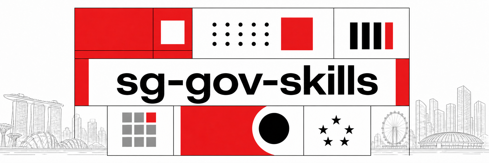

<h1 align="center">Singapore Government Agent Skills for Secure Digital Services, ICT, and Smart Systems</h1>



---

Reusable Agent Skills for Codex, Claude Code, Cursor, and other AI coding agents building secure, accessible digital services for **Singapore government agencies**. Apply ICT&SS Policy Reform requirements, System Security Plans (SSPs), secure coding and CI/CD controls, container security, the Singapore Government Design System (SGDS), and WCAG 2.2 accessibility under the Digital Service Standards (DSS).

Delivering software inside government is its own discipline. The ICT&SS Policy Reform (IM8's successor) and its System Security Plans, Singpass and MyInfo integrations, FormSG pipelines, the Singapore Government Design System (SGDS), WCAG 2.2 accessibility under the Digital Service Standards, PDPA obligations, VAPT, and GeBIZ procurement all shape how you build.

These skills are small, composable, and adaptable so delivery teams can plug them into their agent and get moving. They work with any model. Fork them, adapt them, make them your own.

**Fifteen skills, each with its own eval suite:** figure out which System Security Plan applies, write and audit code against the security controls, harden your CI/CD pipeline, lock down your containers, secure your Generative AI features, run your VAPT and vulnerability management programme, keep government data resident, encrypted, and properly destroyed, capture, protect, and monitor your logs, govern accounts, identity, and privileged access, integrate Singpass and Corppass for citizen and business login and verified-data pre-fill, meet the WCAG 2.2 accessibility bar, and stand up the mandatory service shell. Loading the relevant skill lifts assertion pass rates from as low as 22% to 100% on the benchmark tasks below.

## Installation

Install with the [`skills` CLI](https://github.com/vercel-labs/skills):

### Install all skills in this repo
```sh
npx skills add kyleoliveiro/sg-gov-skills
```

### Install individual skills
```
npx skills add kyleoliveiro/sg-gov-skills -s <skill-name>
```

The CLI installs into `.agents/skills/` and symlinks them into the agent directories you choose (Claude Code, Cursor, Codex, and others).

Running the first command interactively presents the skills under the same four groupings documented below. Individual skill names and `-s <skill-name>` installs are unchanged.


## What these skills help you do

- Determine which Singapore government System Security Plan applies.
- Audit application code against ICT&SS security controls.
- Build secure GitHub and GitLab CI/CD pipelines.
- Harden Docker and Kubernetes workloads.
- Secure Generative AI features against the Gen-AI SSP overlay.
- Set up vulnerability scanning, VAPT, and disclosure programmes.
- Enforce data residency, encryption, DLP, and secure disposal for government data.
- Set up logging, security monitoring, and GCSOC-centralised detection.
- Govern accounts, MFA, Singpass/Corppass and SSO, and the account lifecycle.
- Integrate Singpass and Corppass login and Myinfo pre-fill, and migrate legacy integrations.
- Meet WCAG 2.2 and Digital Service Standards accessibility requirements.
- Build an SGDS-compliant Singapore government service shell.

## Who these skills are for

These skills are for engineers at GovTech, OGP, and Singapore government agencies, as well as tech leads, security reviewers, accessibility specialists, and vendors working with those agencies. They are also useful to teams preparing for architecture reviews, security assessments, accessibility audits, or production readiness checks.

## List of Available Skills

The official [Control Catalog](https://info.standards.tech.gov.sg/control-catalog/) has two catalogs: [Cybersecurity](https://info.standards.tech.gov.sg/control-catalog/cybersecurity/) and [Digital Service Standards](https://info.standards.tech.gov.sg/control-catalog/dss/). The skills below are grouped by the catalog and control domains they directly implement, with National Digital Identity integrations and cross-catalog System Security Plan navigation in their own groups.

### Security System Plan

| Skill | Catalog scope | Description |
| ----- | ------------- | ----------- |
| **System Security Plan Navigator**<br>[ssp-navigator](skills/ssp-navigator/) | [Cybersecurity](https://info.standards.tech.gov.sg/control-catalog/cybersecurity/) and [DSS](https://info.standards.tech.gov.sg/control-catalog/dss/) profiles | Determine which System Security Plan(s) apply under the ICT&SS Policy Reform (IM8's successor), including the Gen-AI overlay and DSS profiles, and emit the Level 0/1/2 control baseline and lifecycle steps. |

### Cybersecurity

| Skill | Control domain(s) | Description |
| ----- | ----------------- | ----------- |
| **Secure Application Coding**<br>[secure-coding-as](skills/secure-coding-as/) | [Application Security (AS)](https://info.standards.tech.gov.sg/control-catalog/cybersecurity/as/); [Cryptography, Encryption and Key Management (CK)](https://info.standards.tech.gov.sg/control-catalog/cybersecurity/ck/) | Write and review application code against AS-1..15 and CK-1..4: input validation, parameterised queries, password hashing, secrets, CSP/HSTS, uploads, and error hygiene. |
| **Secure CI/CD Pipeline**<br>[secure-pipeline](skills/secure-pipeline/) | [Secure Development (SD)](https://info.standards.tech.gov.sg/control-catalog/cybersecurity/sd/); [Software Supply Chain (SC)](https://info.standards.tech.gov.sg/control-catalog/cybersecurity/sc/) | Set up or audit repos and CI/CD against SD-1..10 and SC-1..9, with GitHub/GitLab recipes and open-source fallbacks. |
| **Container Security**<br>[container-security](skills/container-security/) | [Container Security (CS)](https://info.standards.tech.gov.sg/control-catalog/cybersecurity/cs/) | Build, scan, and run containers against CS-1..11: digest-pinned minimal base images, non-root users, runtime secrets, read-only root filesystems, image scanning, private registries, and Kubernetes runtime hardening. |
| **Gen-AI Security**<br>[gen-ai-security](skills/gen-ai-security/) | [Generative AI (GA)](https://info.standards.tech.gov.sg/control-catalog/cybersecurity/ga/); [Data Protection (DP-8)](https://info.standards.tech.gov.sg/control-catalog/cybersecurity/dp/#dp-8-data-classification-disclosure) | Build or audit GenAI features against the Gen-AI SSP overlay (GA-1..8 + DP-8): data-classification routing, provider agreements, approved model formats and loaders, file-upload safeguards, output evaluation, and hallucination acknowledgement. |
| **VAPT & Security Testing**<br>[security-testing](skills/security-testing/) | [Security Testing (ST)](https://info.standards.tech.gov.sg/control-catalog/cybersecurity/st/) | Set up or audit the security testing programme against ST-1..5: host vulnerability assessment scans, cloud security posture management, an RFC 9116 security.txt disclosure channel, VAPT, and severity-based remediation SLAs. |
| **Data Protection**<br>[data-protection](skills/data-protection/) | [Data Protection (DP)](https://info.standards.tech.gov.sg/control-catalog/cybersecurity/dp/) | Build or audit data handling against DP-1..8: Singapore data residency, encryption at rest and in transit, central cloud tenancy, storage sanitisation and destruction, DLP, and classification disclosure at input fields. |
| **Logging & Monitoring**<br>[logging-monitoring](skills/logging-monitoring/) | [Logging and Monitoring (LM)](https://info.standards.tech.gov.sg/control-catalog/cybersecurity/lm/) | Set up or audit logging and monitoring against LM-1..21: security log coverage, tamper-resistant storage, retention and sanitisation, central security log management with GCSOC, detection, and operational monitoring. |
| **Access Control**<br>[access-control](skills/access-control/) | [Access Control (AC)](https://info.standards.tech.gov.sg/control-catalog/cybersecurity/ac/) | Set up or audit identity and access management against AC-1..16: least privilege, MFA, Singpass/Corppass vs government SSO, account lifecycle and reviews, credential rotation, endpoint hardening, and device-based access. |

### Digital Service Standards

| Skill | Control domain(s) | Description |
| ----- | ----------------- | ----------- |
| **Digital Service Standards Accessibility**<br>[dss-accessibility](skills/dss-accessibility/) | WCAG: [Perceivable (WP)](https://info.standards.tech.gov.sg/control-catalog/dss/wp/), [Operable (WO)](https://info.standards.tech.gov.sg/control-catalog/dss/wo/), [Understandable (WU)](https://info.standards.tech.gov.sg/control-catalog/dss/wu/), [Robust (WR)](https://info.standards.tech.gov.sg/control-catalog/dss/wr/) | Build and review frontend code against the 53 WCAG-2.2-derived DSS accessibility controls, with Digital Services (Others) vs Digital Services (High Impact) levels and a testing workflow. |
| **Singapore Government Service Shell**<br>[sg-service-shell](skills/sg-service-shell/) | [Trust and Legitimacy (TL)](https://info.standards.tech.gov.sg/control-catalog/dss/tl/); [Baseline Design Practices (BD)](https://info.standards.tech.gov.sg/control-catalog/dss/bd/); [Performance and Reliability (PR)](https://info.standards.tech.gov.sg/control-catalog/dss/pr/) | Build the common shell for a government digital service: Official Government Banner, WOGAA, official footer, .gov.sg domain, SGDS setup, and the rest of the TL, BD, and PR controls. |

### National Digital Identity

These skills cover Singpass, Myinfo, and Corppass integration and migration. They are implementation companions to Cybersecurity control AC-7, but their primary scope is product APIs, onboarding, data use, and migration rather than a control family.

| Skill | Area | Description |
| ----- | ---- | ----------- |
| **Singpass**<br>[singpass](skills/singpass/) | Digital identity integration | Integrate citizen/resident login and Myinfo (v5) verified person-data pre-fill on the current FAPI 2.0 Singpass API: PAR/PKCE/DPoP, UUID-first identity, Myinfo scopes, onboarding, and app-review rules. |
| **Corppass**<br>[corppass](skills/corppass/) | Digital identity integration | Integrate business-user login and Myinfo Business corporate-data pre-fill via the Corppass Authorization API (FAPI 2.0): entity and user identity, roles, third-party authorisation, onboarding, and provisioning. |
| **Singpass (legacy)**<br>[singpass-legacy](skills/singpass-legacy/) | Legacy integration migration | Maintain, debug, or migrate Myinfo v3/v4 and pre-FAPI Singpass integrations, including their wire formats and mandatory migration deadlines. |
| **Corppass (legacy)**<br>[corppass-legacy](skills/corppass-legacy/) | Legacy integration migration | Maintain or migrate pre-FAPI 2.0 Corppass and Myinfo Business v1/v2 integrations, including claim mapping, identity-model changes, and migration deadlines. |

Each skill lives in [`skills/`](skills/) as a folder with a `SKILL.md` entry point.

## Benchmarks

Every skill ships with an eval suite under `skills/<skill>/evals/`. Each eval is a realistic delivery task: scaffold a portal shell, audit a seeded service, build authenticated endpoints. Each is graded against objective assertions ("every input has a programmatic label", "secrets are read from the environment, never hardcoded", "the Gen-AI overlay controls are emitted"). We run every task twice on the same model, once with the skill and once without, then score the fraction of assertions met.

> **Benchmark refresh pending:** the Cybersecurity skills now include a third holdout scenario and separate description-trigger datasets. The historical results below cover the two scenarios named in the table; the new holdouts are intentionally not folded into the scores until they have been run with the same three-run methodology.

| Skill | Scenarios | Assertions | With skill | Without skill | Lift |
| ----- | :-------: | :--------: | :--------: | :-----------: | :--: |
| [ssp-navigator](skills/ssp-navigator/) | 2 | 18 | **100%** | 22% | +78 pts |
| [secure-coding-as](skills/secure-coding-as/) | 2 | 19 | **100%** | 70% | +30 pts |
| [secure-pipeline](skills/secure-pipeline/) | 2 | 21 | **100%** | 68% | +32 pts |
| [container-security](skills/container-security/) | 2 | 21 | **100%** | 73% | +27 pts |
| [gen-ai-security](skills/gen-ai-security/) | 2 | 22 | **100%** | 47% | +53 pts |
| [security-testing](skills/security-testing/) | 2 | 22 | **100%** | 78% | +22 pts |
| [data-protection](skills/data-protection/) | 2 | 22 | **100%** | 61% | +39 pts |
| [logging-monitoring](skills/logging-monitoring/) | 2 | 22 | **100%** | 74% | +26 pts |
| [access-control](skills/access-control/) | 2 | 23 | **100%** | 69% | +31 pts |
| [singpass](skills/singpass/) | 2 | 23 | **100%** | 45% | +56 pts |
| [corppass](skills/corppass/) | 2 | 22 | **100%** | 51% | +49 pts |
| [corppass-legacy](skills/corppass-legacy/) | 2 | 22 | **100%** | 60% | +40 pts |
| [singpass-legacy](skills/singpass-legacy/) | 2 | 22 | **100%** | 62% | +38 pts |
| [dss-accessibility](skills/dss-accessibility/) | 3 | 27 | **100%** | 83% | +17 pts |
| [sg-service-shell](skills/sg-service-shell/) | 2 | 19 | **100%** | 36% | +64 pts |

The lift is largest where the requirement is hard to guess without knowing the policy: which System Security Plan applies, or that a public service needs the Official Government Banner and WOGAA before feature work. The Singpass and Corppass skills show the same effect for a different reason — the current stack (FAPI 2.0, PAR/DPoP, Myinfo v5, the `sub`-is-the-entity model) largely postdates model training, so a greenfield design without the skill reaches for the wrong version, invents endpoints, or misreads a confidently-held stale belief (a legacy migration baseline insisted "there is no Myinfo v5"). Accessibility shows the smallest gap because a capable model already reaches for common WCAG patterns unprompted; the skill's job there is closing the last mile (control IDs, live-region etiquette, a humane session-expiry state).

<details>
<summary>Per-scenario breakdown</summary>

| Skill | Scenario | Assertions | With skill | Without skill |
| ----- | -------- | :--------: | :--------: | :-----------: |
| ssp-navigator | stacked-genai-service | 10 | 100% | 20% |
| ssp-navigator | cii-migration-gaps | 8 | 100% | 25% |
| secure-coding-as | audit-seeded-service | 8 | 100% | 75% |
| secure-coding-as | build-auth-endpoints | 11 | 100% | 64% |
| secure-pipeline | audit-seeded-pipeline | 9 | 100% | 78% |
| secure-pipeline | setup-github-repo | 12 | 100% | 58% |
| container-security | audit-seeded-containers | 10 | 100% | 77% |
| container-security | harden-container-build | 11 | 100% | 70% |
| gen-ai-security | audit-seeded-genai | 12 | 100% | 67% |
| gen-ai-security | build-genai-feature | 10 | 100% | 27% |
| security-testing | audit-seeded-st-posture | 12 | 100% | 86% |
| security-testing | setup-st-programme | 10 | 100% | 70% |
| data-protection | audit-seeded-dp | 12 | 100% | 61% |
| data-protection | setup-dp-baseline | 10 | 100% | 60% |
| logging-monitoring | audit-seeded-lm | 12 | 100% | 75% |
| logging-monitoring | setup-lm-baseline | 10 | 100% | 73% |
| access-control | audit-seeded-ac | 13 | 100% | 77% |
| access-control | setup-ac-baseline | 10 | 100% | 60% |
| singpass | audit-singpass-integration | 13 | 100% | 59% |
| singpass | design-singpass-service | 10 | 100% | 30% |
| corppass | audit-corppass-integration | 12 | 100% | 74% |
| corppass | design-corppass-service | 10 | 100% | 27% |
| corppass-legacy | audit-half-migrated-corppass | 12 | 100% | 69% |
| corppass-legacy | plan-legacy-corppass-migration | 10 | 100% | 50% |
| singpass-legacy | audit-legacy-singpass-estate | 12 | 100% | 83% |
| singpass-legacy | plan-legacy-singpass-migration | 10 | 100% | 40% |
| dss-accessibility | feedback-form-build | 10 | 100% | 90% |
| dss-accessibility | audit-seeded-page | 8 | 100% | 75% |
| dss-accessibility | timeout-modal | 9 | 100% | 85% |
| sg-service-shell | scaffold-portal-shell | 10 | 100% | 40% |
| sg-service-shell | review-agency-homepage | 9 | 100% | 33% |

</details>

*Methodology: scores are the mean pass rate over 3 runs per configuration. Each scenario reflects its most recent benchmark. Three skills had a follow-up iteration that re-ran a single eval after a fix, and those latest results are the ones shown. "Without skill" is the same model on the same prompt with no skill loaded. Numbers will vary by model; treat them as directional, not a leaderboard.*

## Frequently asked questions

### What is an Agent Skill?

An Agent Skill is a folder of instructions, references, scripts, and other resources that an AI coding agent loads for a specific task. Each skill in this repository has a `SKILL.md` entry point and focuses on one Singapore government delivery concern.

### Which AI coding agents can use these skills?

The skills are model-independent. The `skills` CLI can install them for Codex, Claude Code, Cursor, and other supported agents.

### Can I install a single skill?

Yes. Run `npx skills add kyleoliveiro/sg-gov-skills -s <skill-name>` and replace `<skill-name>` with the slug shown in the Skills table.

### Do these skills guarantee compliance?

No. They help agents apply the published controls, but they do not replace your agency's governance process, security review, or System Security Plan. Verify compliance-critical work against the authoritative standards and your project's approved requirements.

### Are these official Singapore government resources?

No. This is an unofficial, community-maintained project. It is not affiliated with, endorsed by, or published by GovTech, the Singapore Government, or any of its agencies.

## Sources

The control text embedded in these skills is transcribed from the public ICT&SS control catalog and related standards published at [info.standards.tech.gov.sg](https://info.standards.tech.gov.sg/), as of the dates noted in each skill's `SKILL.md`. That site is authoritative and the standards iterate, so verify against the live pages for anything compliance-critical. Each skill links the specific catalog pages it draws from.

## Disclaimer

These skills are provided "as is", without warranty of any kind, express or implied, including but not limited to the warranties of merchantability, fitness for a particular purpose, and non-infringement.

This is an unofficial, community-maintained resource. It is not affiliated with, endorsed by, or published by GovTech, the Singapore Government, or any of its agencies. Nothing here is legal, security, or compliance advice, and installing a skill does not by itself make a system compliant with the ICT&SS Policy Reform, the Digital Service Standards, PDPA, or any other requirement. You are responsible for verifying every control against the authoritative source and your project's System Security Plan.

To the maximum extent permitted by law, the authors and contributors accept no liability for any claim, damages, or other loss arising from the use of this repository. See [LICENSE](LICENSE) for the full terms.

## Contributing

See [`skills/README.md`](skills/README.md) for authoring conventions. In short: one folder per skill, kebab-case name, a `SKILL.md` with `name` and `description` frontmatter, and supporting files (`references/`, `scripts/`, `assets/`) only when they earn their place. Add every new skill to the appropriate catalog table above and installer group in [`.claude-plugin/marketplace.json`](.claude-plugin/marketplace.json).

### Repository layout

```
skills/           Published skills — one folder per skill, each with a SKILL.md
.claude-plugin/   Installer grouping metadata for the skills CLI
skills-lock.json  Lockfile for skills installed locally for authoring (skill-creator, humanizer)
.agents/skills/   Locally installed authoring skills (gitignored; restore with `npx skills experimental_install`)
```

## License

[MIT](LICENSE)
